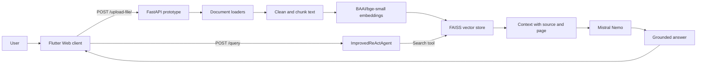

# AgentRAG

## Intelligent document Q&A with retrieval and AI agents

AgentRAG is a document-aware question-answering prototype. A user uploads PDF, DOCX, TXT, or CSV files, then asks questions in natural language. The system retrieves relevant passages, gives the agent source context, and generates an answer with the Mistral language model.

This repository demonstrates the complete AI workflow: document ingestion, text cleaning, chunking, transformer embeddings, vector search, agent orchestration, an asynchronous API, and a Flutter Web client.

> **Project status:** research prototype. The notebook contains the current backend implementation and experiments. It is not presented as a production service yet; the limitations are documented below.

## Why it is interesting

- **Grounded answers:** responses are generated from retrieved document context instead of an empty chat prompt.
- **Multi-format ingestion:** PDF, Word, CSV, plain text, and Markdown files are supported by the loader pipeline.
- **Semantic retrieval:** `BAAI/bge-small-en-v1.5` embeddings are indexed with FAISS; similarity search and MMR are combined to improve context diversity.
- **Agent workflow:** `ImprovedReActAgent` follows a constrained Reason, Act, and Observe loop with a search tool and conversation history.
- **Inspectable sources:** retrieved passages retain source filenames and page metadata for easier review.
- **Usable interface:** the Flutter Web client provides document upload and question-answering in one workflow.

## System flow



See the deeper component notes in [`docs/architecture.md`](docs/architecture.md).

## Repository layout

```text
.
├── frontend/
│   └── flutter_app/               # Flutter client for the upload and Q&A workflow
├── backend/
│   ├── notebooks/
│   │   └── agentrag_backend.ipynb # Current prototype and experiments
│   └── README.md                  # Backend setup, endpoints, and limitations
├── docs/
│   └── architecture.md            # Data flow and design decisions
├── CONTRIBUTING.md
├── .gitignore
└── README.md
```

## Run the Flutter client

Requirements: Flutter with Dart SDK 3.5.3 or newer.

```bash
cd frontend/flutter_app
flutter pub get
flutter run -d chrome --dart-define=AGENTRAG_API_URL=http://localhost:5027
```

The `AGENTRAG_API_URL` value is intentionally supplied at runtime. Do not commit a temporary tunnel URL or a secret into the Flutter source.

## Run the backend prototype

Open [`backend/notebooks/agentrag_backend.ipynb`](backend/notebooks/agentrag_backend.ipynb) in Jupyter or Google Colab and run the cells in order. The notebook installs its Python dependencies, loads the embedding and language models, builds the FAISS index, and exposes the FastAPI endpoints.

The current API contract is:

| Method | Endpoint | Purpose |
| --- | --- | --- |
| `GET` | `/` | Basic health message |
| `POST` | `/upload-file/` | Save a supported document and add it to the index |
| `POST` | `/query` | Ask a question; returns a grounded result |

The Flutter client defaults to `http://localhost:5027`. If the notebook is exposed through a tunnel, pass that URL through `AGENTRAG_API_URL` when launching the client.

## Current limitations

- The backend is notebook-first rather than a packaged Python service with a locked dependency file.
- The FAISS index and uploaded documents are stored in the running process and are not a persistent multi-user data layer.
- The notebook uses permissive CORS and a tunnel-oriented development flow; production deployment should restrict origins, add authentication, validate uploads, and manage secrets through environment variables.
- The current ReAct loop is intentionally small and should be evaluated for answer quality, latency, and failure cases before production use.
- Uploaded documents may contain sensitive information. Use synthetic or authorized documents only and add retention/deletion controls before handling private data.

## Practical next steps

1. Extract the notebook into a typed Python package with `pyproject.toml`, tests, and environment-based configuration.
2. Separate ingestion, retrieval, agent orchestration, and API routes into independent modules.
3. Add persistent document/tenant storage, authentication, rate limits, and document deletion.
4. Add an evaluation set for retrieval recall, groundedness, citation accuracy, latency, and refusal behavior.
5. Add Docker and CI only after the service has a reproducible local command-line workflow.

## License

No license has been declared yet. Until one is added, the code should be treated as all-rights-reserved rather than automatically reusable.
