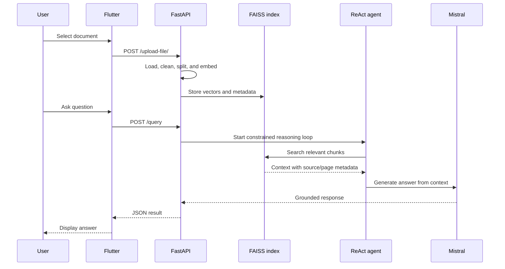

# Architecture notes

## Overview

AgentRAG has two user-facing responsibilities and one retrieval loop:

- The **Flutter client** handles file selection, upload status, conversation history, and question submission.
- The **FastAPI prototype** handles document ingestion and query requests.
- The **retrieval-agent loop** finds relevant chunks, places them into a source-aware context, and asks the language model to answer from that context.

## Data flow

## Key design decisions

### Retrieval before generation

The agent is given a search tool rather than the entire document collection. This keeps the prompt focused and makes the source material available for inspection.

### Metadata is part of the context

Each retrieved chunk is formatted with its source filename and, when available, page metadata. This makes it possible to improve the UI later with citations or “open source” interactions.

### Runtime client configuration

The Flutter client reads `AGENTRAG_API_URL` through `--dart-define`. This separates local development, a staging API, and a future production API without editing source code.

## Production boundary

The current design is a strong portfolio prototype, not a production architecture. A production version should add:

- a Python package with separate `api`, `ingestion`, `retrieval`, `agent`, and `evaluation` modules;
- persistent object storage for uploads and a persistent vector database or durable FAISS snapshots;
- authentication, tenant isolation, file-type and size validation, malware scanning, and deletion workflows;
- restricted CORS, secret management, structured logs, tracing, retries, timeouts, and rate limits;
- offline evaluation for retrieval recall, answer groundedness, citation accuracy, latency, and unsafe output.
